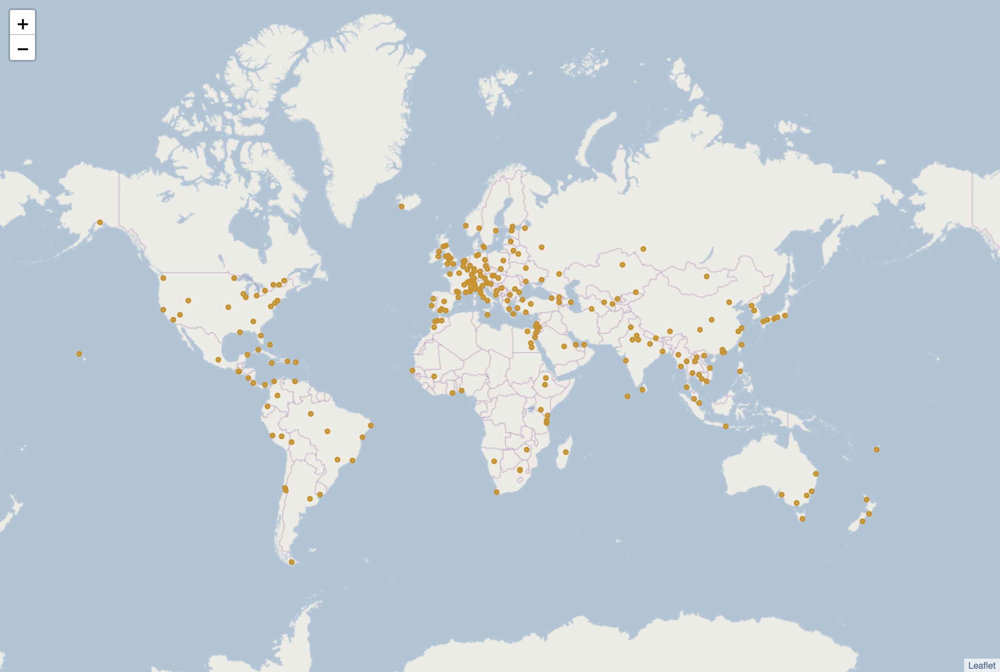

# 
 Applied Data Science Capstone 

---
#### 
 Which Cities are Similar to Saudi Arabia Famous Cities

---
 
 
 
 

##### 
 Nayef Alhaidari 

###### 
 n.alhaidari@hotmail.com 

 
 
 
 

## 1. introduction:

### 1.1. Background

Saudi Arabia where I live just started developing tourism. In September, 2019 it launched the tourist visa and since then more than 400,000 visas were issued. So many of my non-Saudi friends who never been here asks weird questions about Saudi Arabia lifestyle starting from if we are still riding camels or how wealthy people are here. In that project I'll try to help people wondering about Saudi Arabia by pairing its most popular cities to famous cities around the world.
 

Al-Ula, KSA

 

<H3 align="Left">
1.2 Problem
</h3>

Saudi Arabia is unknown to so many people. People around the world were not allowed to visit Saudi Arabia for tourism but things were changed lately and keep changing. So many festivals, concerts and attraction events were conducted last year and it's so fun here. Saudi Arabia is a large country it has various cultures, heritage and natural regions. For that I want to give an idea about which cities you may like in Saudi Arabia to offer a better experience for the visitor.

 

 

 

 Jeddah Cornish

  

<H2 align="Left">
 2. Data Collection
</H2>

For that Project I'll compare Riyadh, Jeddah and Dammam which are the biggest Saudi cities to a list of cities. I found what I want <a href=https://www.listchallenges.com/250-most-famous-cities/html/">Here</a>. So I scraped all cities names. Then I'm going to find a coordinate point in every city and use Foursquare API to collect venues of interest within the city. The table below shows a sample of the dataset.
   

 

<table border="1" class="dataframe">  <thead>    <tr style="text-align: right;">      <th></th>      <th>index</th>      <th>place_id</th>      <th>licence</th>      <th>osm_type</th>      <th>osm_id</th>      <th>boundingbox</th>      <th>lat</th>      <th>lon</th>      <th>display_name</th>      <th>class</th>      <th>type</th>      <th>importance</th>      <th>icon</th>      <th>address</th>      <th>city</th>      <th>city_index</th>      <th>lats</th>      <th>lons</th>      <th>area</th>      <th>centre</th>    </tr>  </thead>  <tbody>    <tr>      <th>0</th>      <td>Brasilia, Brazil_0</td>      <td>234837068</td>      <td>Data © OpenStreetMap contributors, ODbL 1.0. https://osm.org/copyright</td>      <td>relation</td>      <td>59470</td>      <td>[-33.8689056, 5.2693306, -73.9830625, -28.6289646]</td>      <td>-10.333333</td>      <td>-53.200000</td>      <td>Brasil</td>      <td>boundary</td>      <td>administrative</td>      <td>0.845577</td>      <td>https://nominatim.openstreetmap.org/images/mapicons/poi_boundary_administrative.p.20.png</td>      <td>{\'country\': \'Brasil\', \'country_code\': \'br\'}</td>      <td>Brasilia, Brazil</td>      <td>0</td>      <td>[-33.8689056, 5.2693306]</td>      <td>[-73.9830625, -28.6289646]</td>      <td>1775.079396</td>      <td>[-14.299787499999999, -51.30601355]</td>    </tr>    <tr>      <th>1</th>      <td>Valparaiso, Chile_1</td>      <td>233421095</td>      <td>Data © OpenStreetMap contributors, ODbL 1.0. https://osm.org/copyright</td>      <td>relation</td>      <td>198847</td>      <td>[-33.9561939, -26.2862267, -109.4548826, -69.9891619]</td>      <td>-32.597609</td>      <td>-70.852975</td>      <td>Región de Valparaíso, Chile</td>      <td>boundary</td>      <td>administrative</td>      <td>0.642216</td>      <td>https://nominatim.openstreetmap.org/images/mapicons/poi_boundary_administrative.p.20.png</td>      <td>{\'state\': \'Región de Valparaíso\', \'country\': \'Chile\', \'country_code\': \'cl\'}</td>      <td>Valparaiso, Chile</td>      <td>1</td>      <td>[-33.9561939, -26.2862267]</td>      <td>[-109.4548826, -69.9891619]</td>      <td>302.700783</td>      <td>[-30.1212103, -89.72202225000001]</td>    </tr>    <tr>      <th>2</th>      <td>Tokyo, Japan_0</td>      <td>235620763</td>      <td>Data © OpenStreetMap contributors, ODbL 1.0. https://osm.org/copyright</td>      <td>relation</td>      <td>1543125</td>      <td>[20.2145811, 35.8984245, 135.8536855, 154.205541]</td>      <td>35.682839</td>      <td>139.759455</td>      <td>東京都, 日本 (Japan)</td>      <td>boundary</td>      <td>administrative</td>      <td>0.859331</td>      <td>https://nominatim.openstreetmap.org/images/mapicons/poi_boundary_administrative.p.20.png</td>      <td>{\'state\': \'東京都\', \'country\': \'日本 (Japan)\', \'country_code\': \'jp\'}</td>      <td>Tokyo, Japan</td>      <td>0</td>      <td>[20.2145811, 35.8984245]</td>      <td>[135.8536855, 154.205541]</td>      <td>287.827628</td>      <td>[28.056502799999997, 145.02961325]</td>    </tr>    <tr>      <th>3</th>      <td>Honolulu, United States_1</td>      <td>235707068</td>      <td>Data © OpenStreetMap contributors, ODbL 1.0. https://osm.org/copyright</td>      <td>relation</td>      <td>3861844</td>      <td>[21.2160765, 28.517269, -178.443593, -157.6158857]</td>      <td>21.468151</td>      <td>-157.960511</td>      <td>Honolulu County, Hawaii, United States of America</td>      <td>boundary</td>      <td>administrative</td>      <td>0.774616</td>      <td>https://nominatim.openstreetmap.org/images/mapicons/poi_boundary_administrative.p.20.png</td>      <td>{\'county\': \'Honolulu County\', \'state\': \'Hawaii\', \'country\': \'United States of America\', \'country_code\': \'us\'}</td>      <td>Honolulu, United States</td>      <td>1</td>      <td>[21.2160765, 28.517269]</td>      <td>[-178.443593, -157.6158857]</td>      <td>152.067100</td>      <td>[24.86667275, -168.02973935]</td>    </tr>    <tr>      <th>4</th>      <td>Buenos Aires, Argentina_1</td>      <td>234602538</td>      <td>Data © OpenStreetMap contributors, ODbL 1.0. https://osm.org/copyright</td>      <td>relation</td>      <td>1632167</td>      <td>[-41.0383393, -33.2616119, -63.3927932, -56.6646715]</td>      <td>-36.378993</td>      <td>-60.385589</td>      <td>Buenos Aires, Argentina</td>      <td>boundary</td>      <td>administrative</td>      <td>0.929989</td>      <td>https://nominatim.openstreetmap.org/images/mapicons/poi_boundary_administrative.p.20.png</td>      <td>{\'state\': \'Buenos Aires\', \'country\': \'Argentina\', \'country_code\': \'ar\'}</td>      <td>Buenos Aires, Argentina</td>      <td>1</td>      <td>[-41.0383393, -33.2616119]</td>      <td>[-63.3927932, -56.6646715]</td>      <td>52.322768</td>      <td>[-37.1499756, -60.02873235]</td>    </tr>  </tbody></table>

  
cities to be considered is shown in the following picture.
 

   

Cities Points

 

 <H2 align="Left">
 3 Methodology
 </h3>

  
In this Project I used KMeans to clusters cities bast on venues' categories collected from Foursquare API using explore endpoint. and then I predict the largest Sadi Arabia cities. and then visualized each of their clusters you can view the notebook from <a href="https://github.com/nalhaidari/Applied_Data_Science_Capstone/tree/master/final_assignment/Notebook/Cities_clustring.ipynb"> Here</a>.

 

 <H2 align="Left">
 4 Results
 </h3>

 <H2 align="Left">
 5 Discussion
 </h3>

 Discussion section where you discuss any observations you noted and any recommendations you can make based on the results.

 When I first decided to create this study I was expecting to find clusters of restaurants in certain regions and the final result didn't meet that expectation.

  <H2 align="Left">
  6 Conclusion
  </h3>
